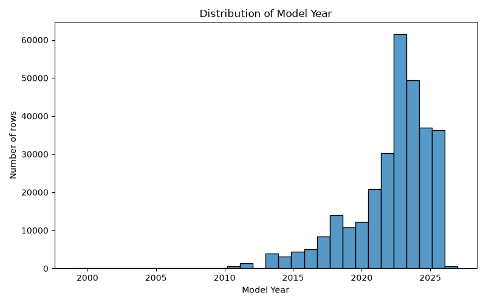
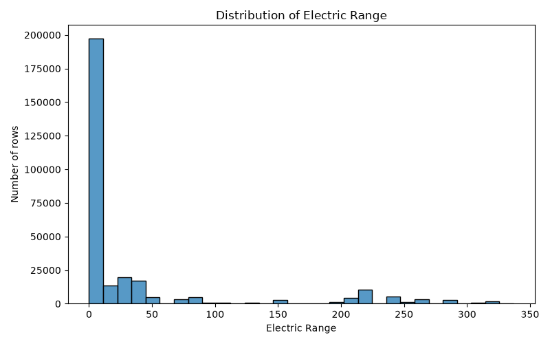
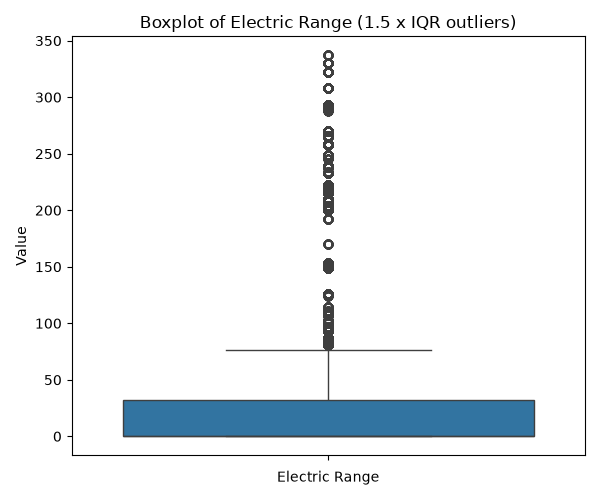
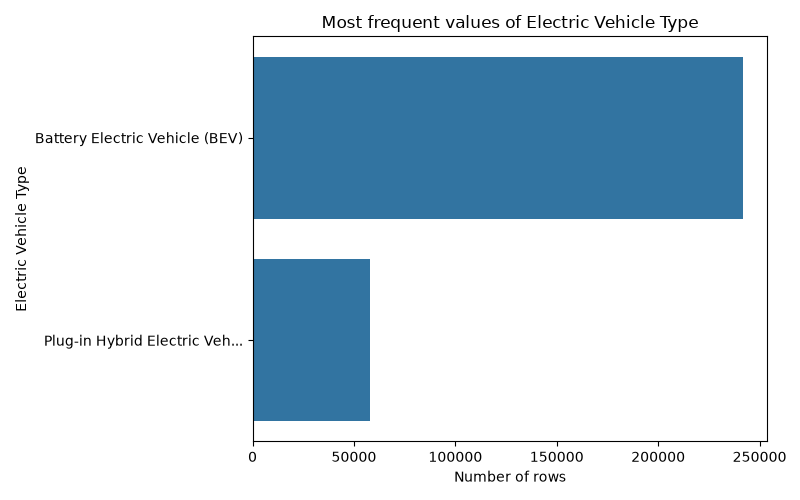
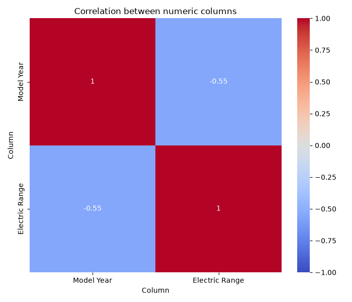
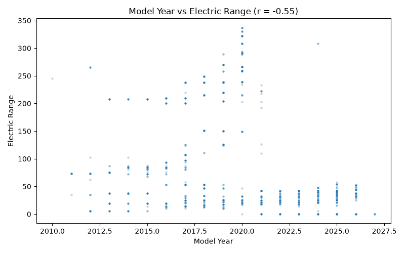
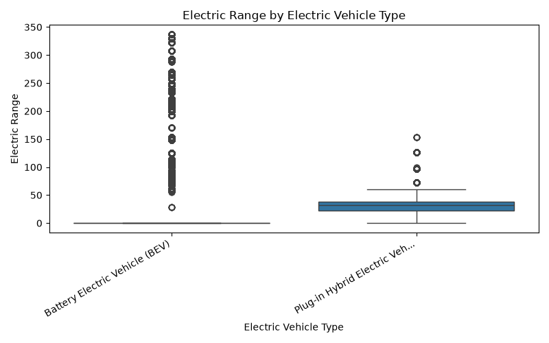

# Data Profile: ElectricVehiclePopulation.csv

## 1. Dataset Overview
- File name: ElectricVehiclePopulation.csv
- Rows: 299705
- Columns: 16

Column profile (roles are inferred from values and names; column meanings and units are unknown):
```
                                           column technical_type                  role  non_missing  missing_%  unique                                note
                                       VIN (1-10)         string Categorical attribute       299705       0.00   18376 high cardinality (18376 categories)
                                           County         string Categorical attribute       299694       0.00     255   high cardinality (255 categories)
                                             City         string Categorical attribute       299694       0.00     941   high cardinality (941 categories)
                                            State         string Categorical attribute       299705       0.00      50                                    
                                      Postal Code        integer Identifier-like field       299694       0.00    1201         name suggests an ID or code
                                       Model Year        integer       Numeric measure       299705       0.00      23                                    
                                             Make         string Categorical attribute       299705       0.00      51    high cardinality (51 categories)
                                            Model         string Categorical attribute       299705       0.00     202   high cardinality (202 categories)
                            Electric Vehicle Type         string Categorical attribute       299705       0.00       2                                    
Clean Alternative Fuel Vehicle (CAFV) Eligibility         string Categorical attribute       299705       0.00       3                                    
                                   Electric Range        integer       Numeric measure       299679       0.01     117                                    
                             Legislative District        integer Identifier-like field       298915       0.26      49         name suggests an ID or code
                                   DOL Vehicle ID        integer Identifier-like field       299705       0.00  299705         name suggests an ID or code
                                 Vehicle Location         string Categorical attribute       299685       0.01    1199  high cardinality (1199 categories)
                                 Electric Utility         string Categorical attribute       299694       0.00      77    high cardinality (77 categories)
                                       2020 GEOID        integer Identifier-like field       299694       0.00    2466         name suggests an ID or code
```

## 2. Data Quality
- duplicate_rows: 0
- duplicate_%: 0.0
- empty_columns: []
- constant_columns: []
- high_missing_threshold_%: 30
- high_missing_columns: []
- mixed_type_columns: []
- high_cardinality_columns: ['VIN (1-10)', 'County', 'City', 'Postal Code', 'Make', 'Model', 'Legislative District', 'DOL Vehicle ID', 'Vehicle Location', 'Electric Utility', '2020 GEOID']
- sensitive_columns: ['VIN (1-10): name suggests an identification number', 'Postal Code: postal code, can help identify where someone lives', 'Vehicle Location: may contain precise locations']
- sensitive_note: Sensitive-field detection is only a heuristic based on column names and simple value patterns. No warning does NOT mean the data is safe.

High missingness threshold: 30% of rows. Above this level, analysis of a column rests on less than 70% of the rows.
Nothing was deleted or changed. Problems are only flagged.

## 3. Descriptive Statistics
Numeric columns (outliers use the 1.5 x IQR rule and are only counted, never removed):
```
               Model Year  Electric Range
valid_count     299705.00       299679.00
missing_count        0.00           26.00
missing_%            0.00            0.01
min               1999.00            0.00
max               2027.00          337.00
mean              2022.34           36.66
median            2023.00            0.00
mode              2023.00            0.00
std                  3.09           76.03
q1                2021.00            0.00
q3                2024.00           32.00
iqr                  3.00           32.00
outlier_count    18282.00        43197.00
outlier_%            6.10           14.41
```

**VIN (1-10)**: 18376 categories, most frequent: ['7SAYGDEE7P']
```
     value  count  percent
7SAYGDEE7P   1228     0.41
7SAYGDEE6P   1219     0.41
7SAYGDEE9T   1207     0.40
7SAYGDEE1T   1186     0.40
7SAYGDEE4T   1181     0.39
7SAYGDEEXT   1179     0.39
7SAYGDEE0T   1177     0.39
7SAYGDEE8P   1177     0.39
7SAYGDEE5P   1176     0.39
7SAYGDEEXP   1175     0.39
```

**County**: 255 categories, most frequent: ['King']
```
    value  count  percent
     King 144257    48.13
Snohomish  37818    12.62
   Pierce  25042     8.36
    Clark  18803     6.27
 Thurston  10985     3.67
   Kitsap  10351     3.45
  Spokane   8741     2.92
  Whatcom   7560     2.52
   Benton   4507     1.50
   Skagit   3570     1.19
```

**City**: 941 categories, most frequent: ['Seattle']
```
    value  count  percent
  Seattle  45469    15.17
 Bellevue  14386     4.80
Vancouver  11215     3.74
  Redmond  10135     3.38
  Bothell   9819     3.28
 Kirkland   8487     2.83
Sammamish   8129     2.71
   Renton   7897     2.64
  Olympia   7016     2.34
   Tacoma   6651     2.22
```

**State**: 50 categories, most frequent: ['WA']
```
value  count  percent
   WA 298916    99.74
   CA    180     0.06
   VA    105     0.04
   MD     46     0.02
   TX     46     0.02
   FL     44     0.01
   OR     28     0.01
   NV     27     0.01
   CO     25     0.01
   AZ     25     0.01
```

**Make**: 51 categories, most frequent: ['TESLA']
```
    value  count  percent
    TESLA 122981    41.03
CHEVROLET  20236     6.75
     FORD  16118     5.38
   NISSAN  16053     5.36
      KIA  14776     4.93
   TOYOTA  13998     4.67
      BMW  12356     4.12
  HYUNDAI  12351     4.12
   RIVIAN   9817     3.28
    VOLVO   8187     2.73
```

**Model**: 202 categories, most frequent: ['MODEL Y']
```
         value  count  percent
       MODEL Y  66545    22.20
       MODEL 3  39391    13.14
          LEAF  13453     4.49
       MODEL S   7873     2.63
       BOLT EV   7642     2.55
       IONIQ 5   7531     2.51
       MODEL X   7177     2.39
MUSTANG MACH-E   6865     2.29
          ID.4   6337     2.11
           R1S   5632     1.88
```

**Electric Vehicle Type**: 2 categories, most frequent: ['Battery Electric Vehicle (BEV)']
```
                                 value  count  percent
        Battery Electric Vehicle (BEV) 241724    80.65
Plug-in Hybrid Electric Vehicle (PHEV)  57981    19.35
```

**Clean Alternative Fuel Vehicle (CAFV) Eligibility**: 3 categories, most frequent: ['Eligibility unknown as battery range has not been researched']
```
                                                       value  count  percent
Eligibility unknown as battery range has not been researched 196235    65.48
                     Clean Alternative Fuel Vehicle Eligible  79293    26.46
                       Not eligible due to low battery range  24177     8.07
```

**Vehicle Location**: 1199 categories, most frequent: ['POINT (-122.13158 47.67858)']
```
                      value  count  percent
POINT (-122.13158 47.67858)   7155     2.39
POINT (-122.20105 47.84423)   5739     1.92
 POINT (-122.2066 47.67887)   4816     1.61
POINT (-122.12096 47.55584)   4629     1.54
 POINT (-122.1872 47.61001)   4204     1.40
 POINT (-122.3185 47.67949)   4168     1.39
POINT (-122.03133 47.62858)   3843     1.28
POINT (-122.20928 47.71124)   3771     1.26
POINT (-122.15545 47.75448)   3757     1.25
POINT (-122.21238 47.57816)   3332     1.11
```

**Electric Utility**: 77 categories, most frequent: ['PUGET SOUND ENERGY INC||CITY OF TACOMA - (WA)']
```
                                                                          value  count  percent
                                  PUGET SOUND ENERGY INC||CITY OF TACOMA - (WA) 103988    34.70
                                                         PUGET SOUND ENERGY INC  63791    21.29
                                   CITY OF SEATTLE - (WA)|CITY OF TACOMA - (WA)  48888    16.31
               BONNEVILLE POWER ADMINISTRATION||PUD NO 1 OF CLARK COUNTY - (WA)  18318     6.11
BONNEVILLE POWER ADMINISTRATION||CITY OF TACOMA - (WA)||PENINSULA LIGHT COMPANY  13964     4.66
                             PUGET SOUND ENERGY INC||PUD NO 1 OF WHATCOM COUNTY   7120     2.38
     BONNEVILLE POWER ADMINISTRATION||AVISTA CORP||INLAND POWER & LIGHT COMPANY   5515     1.84
                     BONNEVILLE POWER ADMINISTRATION||PUD 1 OF SNOHOMISH COUNTY   2959     0.99
                                                                     PACIFICORP   2773     0.93
                     BONNEVILLE POWER ADMINISTRATION||PUD NO 1 OF BENTON COUNTY   2684     0.90
```

## 4. Relationships Between Variables
Correlation shows association only, never causation.
```
                Model Year  Electric Range
Model Year            1.00           -0.55
Electric Range       -0.55            1.00
```
- Strongest positive: None
- Strongest negative: {'column_a': 'Model Year', 'column_b': 'Electric Range', 'r': -0.55, 'strength': 'strong'}

## 5. Visualizations
### Distribution of Model Year


### Distribution of Electric Range


### Boxplot of Electric Range


### Most frequent values of Electric Vehicle Type


### Correlation between numeric columns


### Model Year vs Electric Range


### Electric Range by Electric Vehicle Type


Plot types skipped:
- Missing-value bar chart: every column is less than 1% missing

## 6. AI-Assisted Insights
Written by the local Ollama model qwen2.5:7b from the Python summary (analysis_summary.json).

- [Data quality] The column "Legislative District" has 26.0% (78,910) missing values, which could indicate potential bias or incomplete data collection.
- [Distribution] The "Model Year" column shows a negative correlation with "Electric Range," with an r value of -0.55, indicating that newer electric vehicles tend to have shorter ranges.
- [Categorical] The "VIN (1-10)" column has 18,376 unique values, suggesting high cardinality, which might complicate data analysis and pattern recognition.
- [Categorical] The "County" column has "King" as the most frequent category, accounting for 48.13% of the data, which may indicate a geographical bias towards this area.
- [Categorical] The "Make" column is dominated by "TESLA," with 41.03% of the entries, highlighting the company's significant market presence.
- [Limitation] The "Electric Range" column has 26 missing values, which might limit the analysis of electric vehicle performance and range.
- [Question] How does the distribution of electric vehicle models vary across different counties, and could this reflect regional preferences or policies?
- [Relationship] There is a strong negative correlation between "Model Year" and "Electric Range," suggesting that older vehicles tend to have longer ranges, possibly due to earlier models being less efficient.

Verification: numbers in the insights that do not appear in the Python results: [78910.0]
This check confirms a number exists in the Python results, not that it is attached to the right column, so each insight should be read against the statistics above.

## 7. Limitations
- Column meanings, units and valid ranges are unknown; roles are inferred from values and names only.
- The 1.5 x IQR rule flags many values in skewed columns; a flagged value is not necessarily an error.
- Correlation shows association only, not causation.
- Sensitive-field detection is only a heuristic based on column names and simple value patterns. No warning does NOT mean the data is safe.
- AI insights can attach a real number to the wrong column; they must be reviewed by a person.