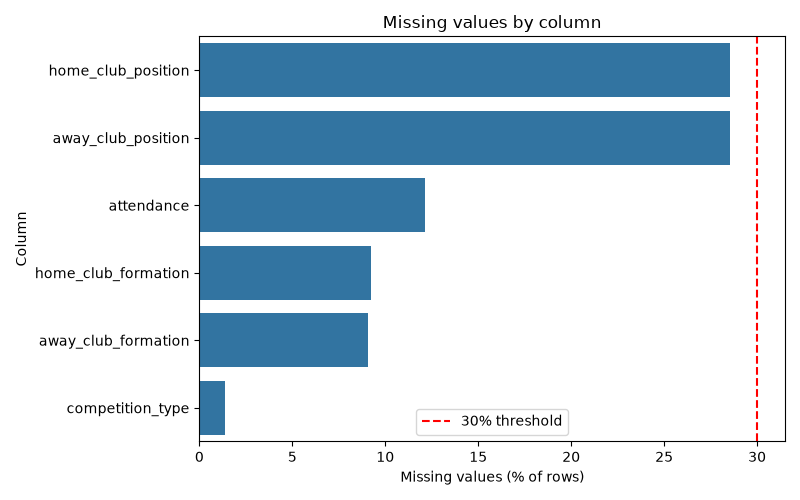
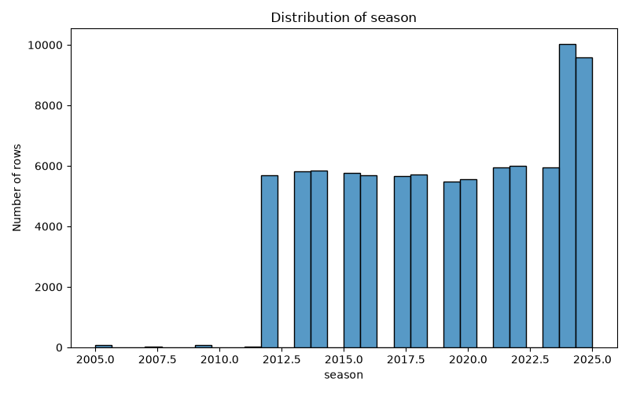
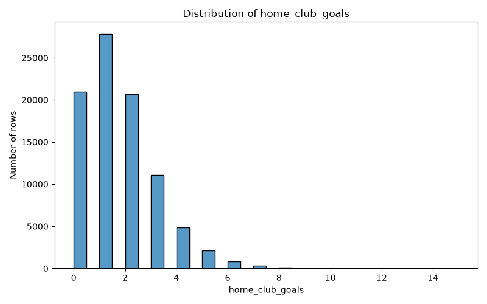
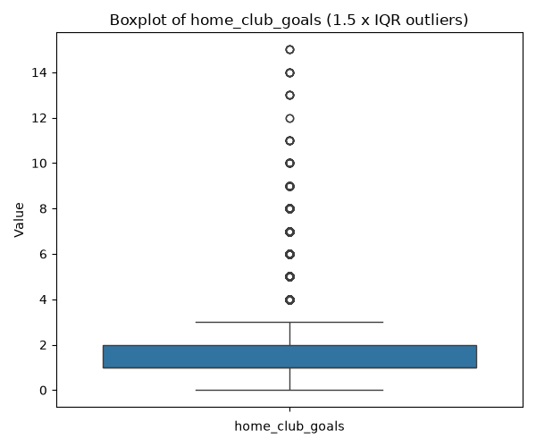
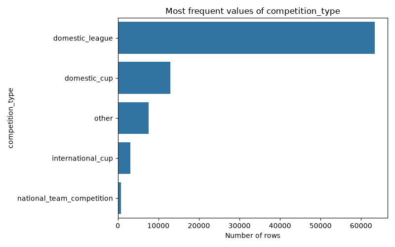
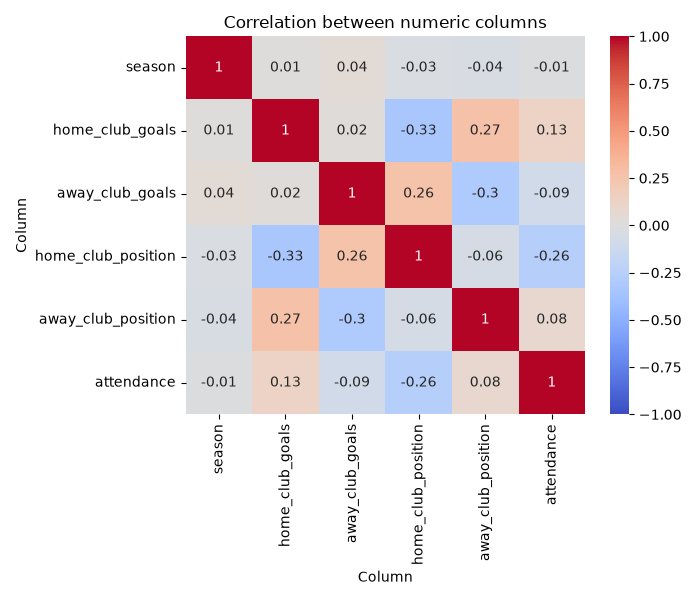
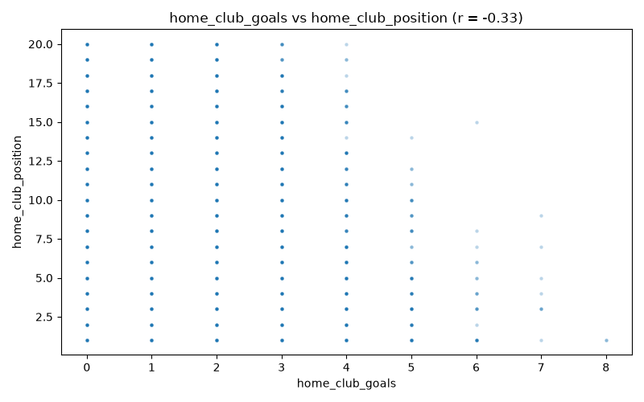
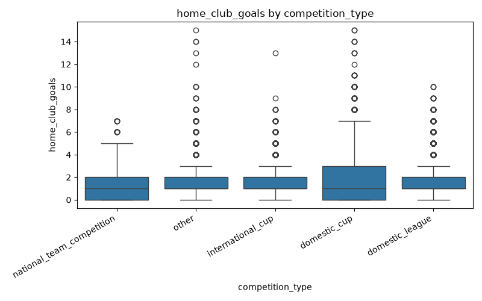

# Data Profile: games.csv

## 1. Dataset Overview
- File name: games.csv
- Rows: 88958
- Columns: 23

Column profile (roles are inferred from values and names; column meanings and units are unknown):
```
                column technical_type                  role  non_missing  missing_%  unique                                            note
               game_id        integer Identifier-like field        88958       0.00   88958                     name suggests an ID or code
        competition_id         string Categorical attribute        88958       0.00      70                high cardinality (70 categories)
                season        integer       Numeric measure        88958       0.00      18                                                
                 round         string Categorical attribute        88958       0.00     128               high cardinality (128 categories)
                  date       datetime       Date-like field        88958       0.00    4445 ambiguous dates like 03/04 are read month-first
          home_club_id        integer Identifier-like field        88958       0.00    2980                     name suggests an ID or code
          away_club_id        integer Identifier-like field        88958       0.00    2634                     name suggests an ID or code
       home_club_goals        integer       Numeric measure        88958       0.00      16                                                
       away_club_goals        integer       Numeric measure        88958       0.00      18                                                
    home_club_position        integer       Numeric measure        63581      28.53      21                                                
    away_club_position        integer       Numeric measure        63581      28.53      21                                                
home_club_manager_name         string Categorical attribute        88114       0.95    6137              high cardinality (6137 categories)
away_club_manager_name         string Categorical attribute        88114       0.95    5756              high cardinality (5756 categories)
               stadium         string Categorical attribute        88716       0.27    2968              high cardinality (2968 categories)
            attendance        integer       Numeric measure        78155      12.14   33301                                                
               referee         string Categorical attribute        88280       0.76    3135              high cardinality (3135 categories)
                   url         string Identifier-like field        88958       0.00   88958                       100% of values are unique
   home_club_formation         string Categorical attribute        80758       9.22      57                high cardinality (57 categories)
   away_club_formation         string Categorical attribute        80885       9.08      68                high cardinality (68 categories)
        home_club_name         string Categorical attribute        88872       0.10    2901              high cardinality (2901 categories)
        away_club_name         string Categorical attribute        88922       0.04    2600              high cardinality (2600 categories)
             aggregate         string Categorical attribute        88958       0.00     119               high cardinality (119 categories)
      competition_type         string Categorical attribute        87744       1.36       5                                                
```

## 2. Data Quality
- duplicate_rows: 0
- duplicate_%: 0.0
- empty_columns: []
- constant_columns: []
- high_missing_threshold_%: 30
- high_missing_columns: []
- mixed_type_columns: []
- high_cardinality_columns: ['game_id', 'competition_id', 'round', 'home_club_id', 'away_club_id', 'home_club_manager_name', 'away_club_manager_name', 'stadium', 'referee', 'url', 'home_club_formation', 'away_club_formation', 'home_club_name', 'away_club_name', 'aggregate']
- sensitive_columns: ['home_club_manager_name: may contain names of people', 'away_club_manager_name: may contain names of people', 'home_club_name: may contain names of people', 'away_club_name: may contain names of people']
- sensitive_note: Sensitive-field detection is only a heuristic based on column names and simple value patterns. No warning does NOT mean the data is safe.

High missingness threshold: 30% of rows. Above this level, analysis of a column rests on less than 70% of the rows.
Nothing was deleted or changed. Problems are only flagged.

## 3. Descriptive Statistics
Numeric columns (outliers use the 1.5 x IQR rule and are only counted, never removed):
```
                 season  home_club_goals  away_club_goals  home_club_position  away_club_position  attendance
valid_count    88958.00         88958.00         88958.00            63581.00            63581.00    78155.00
missing_count      0.00             0.00             0.00            25377.00            25377.00    10803.00
missing_%          0.00             0.00             0.00               28.53               28.53       12.14
min             2005.00             0.00             0.00                1.00                1.00        1.00
max             2025.00            15.00            19.00               21.00               21.00    99354.00
mean            2019.04             1.60             1.33                9.11                9.29    18282.46
median          2019.00             1.00             1.00                9.00                9.00    12350.00
mode            2024.00             1.00             1.00                1.00                5.00     1000.00
std                4.25             1.42             1.36                5.27                5.29    17922.47
q1              2015.00             1.00             0.00                5.00                5.00     4418.50
q3              2023.00             2.00             2.00               13.00               14.00    26353.00
iqr                8.00             1.00             2.00                8.00                9.00    21934.50
outlier_count      0.00          8433.00          1086.00                0.00                0.00     3305.00
outlier_%          0.00             9.48             1.22                0.00                0.00        4.23
```

**competition_id**: 70 categories, most frequent: ['ES1', 'GB1', 'IT1']
```
value  count  percent
  GB1   5320     5.98
  ES1   5320     5.98
  IT1   5320     5.98
  FR1   4997     5.62
  TR1   4618     5.19
   L1   4284     4.82
  NL1   4210     4.73
  PO1   4152     4.67
  BE1   3550     3.99
  RU1   3360     3.78
```

**round**: 128 categories, most frequent: ['First Round']
```
       value  count  percent
 First Round   3355     3.77
Second Round   2597     2.92
 2. Matchday   1966     2.21
 1. Matchday   1964     2.21
11. Matchday   1957     2.20
10. Matchday   1956     2.20
 3. Matchday   1954     2.20
 8. Matchday   1950     2.19
 7. Matchday   1947     2.19
 4. Matchday   1945     2.19
```

**home_club_manager_name**: 6137 categories, most frequent: ['Diego Simeone']
```
               value  count  percent
       Diego Simeone    374     0.42
       Pep Guardiola    356     0.40
          Unai Emery    352     0.40
     Brendan Rodgers    318     0.36
       José Mourinho    316     0.36
Gian Piero Gasperini    315     0.36
        Jürgen Klopp    306     0.35
     Carlo Ancelotti    300     0.34
    Ernesto Valverde    291     0.33
   Manuel Pellegrini    285     0.32
```

**away_club_manager_name**: 5756 categories, most frequent: ['Diego Simeone']
```
               value  count  percent
       Diego Simeone    394     0.45
          Unai Emery    367     0.42
       Pep Guardiola    365     0.41
       José Mourinho    324     0.37
     Brendan Rodgers    311     0.35
        Jürgen Klopp    309     0.35
Gian Piero Gasperini    307     0.35
     Carlo Ancelotti    299     0.34
    Ernesto Valverde    295     0.33
   Manuel Pellegrini    292     0.33
```

**stadium**: 2968 categories, most frequent: ['Olimpico di Roma']
```
                value  count  percent
     Olimpico di Roma    718     0.81
      Giuseppe Meazza    697     0.79
       Luigi Ferraris    496     0.56
         AFAS Stadion    436     0.49
Marcantonio Bentegodi    369     0.42
      Artemio Franchi    369     0.42
      Allianz Stadium    367     0.41
      Stamford Bridge    364     0.41
       Etihad Stadium    364     0.41
        Allianz Arena    362     0.41
```

**referee**: 3135 categories, most frequent: ['Anthony Taylor']
```
            value  count  percent
   Anthony Taylor    553     0.63
   Michael Oliver    546     0.62
   Danny Makkelie    483     0.55
 Serdar Gözübüyük    429     0.49
Jesús Gil Manzano    395     0.45
   Clément Turpin    386     0.44
     Craig Pawson    383     0.43
    Willie Collum    368     0.42
     Felix Zwayer    363     0.41
      Bas Nijhuis    356     0.40
```

**home_club_formation**: 57 categories, most frequent: ['4-2-3-1']
```
          value  count  percent
        4-2-3-1  25851    32.01
4-3-3 Attacking  12596    15.60
 4-4-2 double 6   7149     8.85
        4-1-4-1   4392     5.44
4-3-3 Defending   4085     5.06
          4-4-2   3690     4.57
        3-4-2-1   3629     4.49
          3-4-3   3168     3.92
     3-5-2 flat   3160     3.91
        3-4-1-2   1740     2.15
```

**away_club_formation**: 68 categories, most frequent: ['4-2-3-1']
```
          value  count  percent
        4-2-3-1  25190    31.14
4-3-3 Attacking  12384    15.31
 4-4-2 double 6   6618     8.18
        4-1-4-1   4561     5.64
4-3-3 Defending   4040     4.99
        3-4-2-1   3786     4.68
          4-4-2   3694     4.57
     3-5-2 flat   3482     4.30
          3-4-3   3228     3.99
          5-3-2   1782     2.20
```

**home_club_name**: 2901 categories, most frequent: ['Real Madrid']
```
             value  count  percent
       Real Madrid    403     0.45
      FC Barcelona    395     0.44
        Chelsea FC    383     0.43
       Juventus FC    382     0.43
   Manchester City    380     0.43
Atlético de Madrid    374     0.42
        Arsenal FC    370     0.42
 Manchester United    364     0.41
      Liverpool FC    362     0.41
        Sevilla FC    361     0.41
```

**away_club_name**: 2600 categories, most frequent: ['Real Madrid']
```
             value  count  percent
       Real Madrid    406     0.46
      FC Barcelona    405     0.46
Atlético de Madrid    395     0.44
        Sevilla FC    390     0.44
   Manchester City    384     0.43
     Bayern Munich    376     0.42
        Chelsea FC    376     0.42
 Manchester United    367     0.41
      Liverpool FC    366     0.41
        Arsenal FC    363     0.41
```

**aggregate**: 119 categories, most frequent: ['1:1']
```
value  count  percent
  1:1   8958    10.07
  1:0   8451     9.50
  2:1   7493     8.42
  0:1   6721     7.56
  2:0   6573     7.39
  1:2   6176     6.94
  0:0   5567     6.26
  0:2   4533     5.10
  2:2   3886     4.37
  3:0   3881     4.36
```

**competition_type**: 5 categories, most frequent: ['domestic_league']
```
                    value  count  percent
          domestic_league  63382    72.24
             domestic_cup  12904    14.71
                    other   7599     8.66
        international_cup   3117     3.55
national_team_competition    742     0.85
```

## 4. Relationships Between Variables
Correlation shows association only, never causation.
```
                    season  home_club_goals  away_club_goals  home_club_position  away_club_position  attendance
season                1.00             0.01             0.04               -0.03               -0.04       -0.01
home_club_goals       0.01             1.00             0.02               -0.33                0.27        0.13
away_club_goals       0.04             0.02             1.00                0.26               -0.30       -0.09
home_club_position   -0.03            -0.33             0.26                1.00               -0.06       -0.26
away_club_position   -0.04             0.27            -0.30               -0.06                1.00        0.08
attendance           -0.01             0.13            -0.09               -0.26                0.08        1.00
```
- Strongest positive: {'column_a': 'home_club_goals', 'column_b': 'away_club_position', 'r': 0.27, 'strength': 'weak'}
- Strongest negative: {'column_a': 'home_club_goals', 'column_b': 'home_club_position', 'r': -0.33, 'strength': 'moderate'}

## 5. Visualizations
### Missing values by column

Why this plot: Chosen to show which columns have missing values, and how close they are to the 30% threshold.

### Distribution of season

Why this plot: Chosen because it shows the distribution of a numeric column: clusters, skew, and peaks.

### Distribution of home_club_goals

Why this plot: Chosen because it shows the distribution of a numeric column: clusters, skew, and peaks.

### Boxplot of home_club_goals

Why this plot: Chosen because it shows the median, the spread and the 1.5 x IQR outliers of the numeric column with the most outliers

### Most frequent values of competition_type

Why this plot: Chosen because it compares how many rows fall in each category of a column with 2 to 10 categories

### Correlation between numeric columns

Why this plot: Chosen because it shows the correlation between every pair of numeric measure columns at once

### home_club_goals vs home_club_position

Why this plot: Chosen because it shows the pair with the strongest correlation point by point

### home_club_goals by competition_type

Why this plot: Chosen because it compares a numeric column across the categories of a small categorical column


## 6. AI-Assisted Insights
Written by the local Ollama model qwen2.5:7b from the Python summary (analysis_summary.json).

- [Data quality] The `home_club_position` and `away_club_position` columns have 28.53% missing values, which could indicate incomplete or outdated data.
- [Distribution] The `home_club_goals` column has a higher mean (1.6) compared to the median (1.0), suggesting right-skewed data with a few high-scoring games.
- [Categorical] The `competition_id` column has 70 unique categories, indicating a high cardinality that could complicate data analysis without proper grouping.
- [Relationship] There is a moderate negative correlation (-0.33) between `home_club_goals` and `home_club_position`, suggesting that higher-ranked home clubs might perform worse.
- [Limitation] The `attendance` column has 12.14% missing values, which might limit the accuracy of attendance-related analyses.
- [Question] Why are there more missing values in the `home_club_position` and `away_club_position` columns compared to others?
- [Distribution] The `attendance` column shows a wide range of values from 1 to 99354, with a mean of 18,282, indicating significant variability in stadium attendance.
- [Categorical] The `home_club_formation` and `away_club_formation` columns have 32.01% and 31.14% of data in the most frequent formation "4-2-3-1," respectively, suggesting a common formation in the dataset.

Verification: numbers in the insights that do not appear in the Python results: [18282.0]
This check confirms a number exists in the Python results, not that it is attached to the right column, so each insight should be read against the statistics above.

## 7. Limitations
- Column meanings, units and valid ranges are unknown; roles are inferred from values and names only.
- The 1.5 x IQR rule flags many values in skewed columns; a flagged value is not necessarily an error.
- Correlation shows association only, not causation.
- Sensitive-field detection is only a heuristic based on column names and simple value patterns. No warning does NOT mean the data is safe.
- AI insights can attach a real number to the wrong column; they must be reviewed by a person.